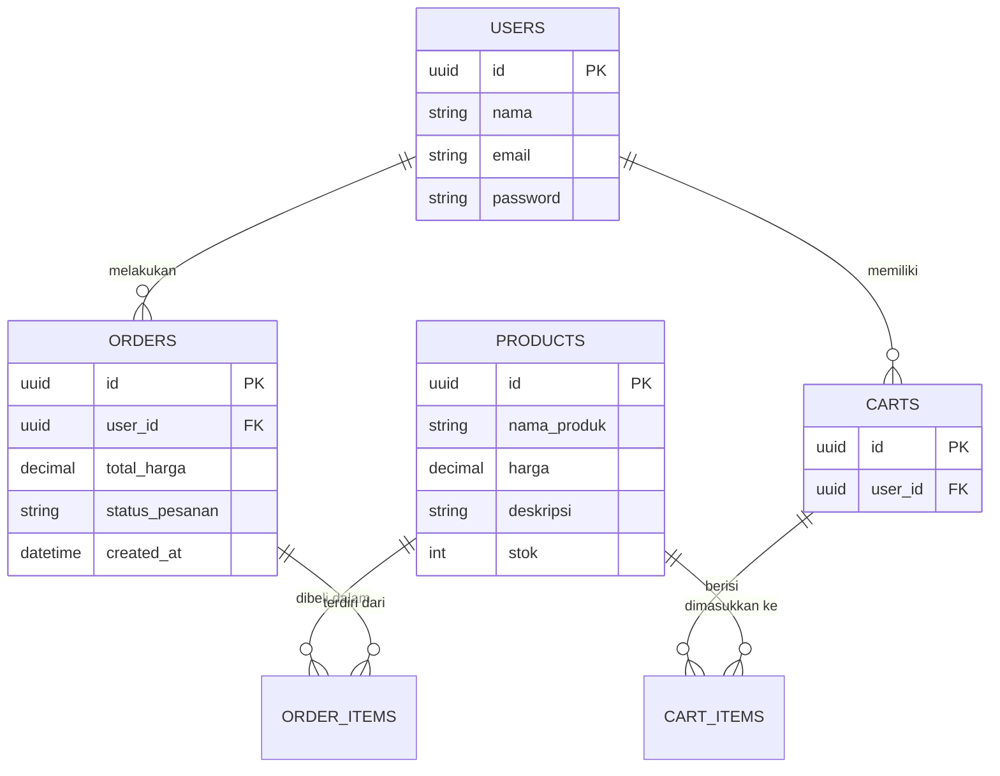

# 👕 Chrome Hearts Streetwear App


> **Chrome Hearts Streetwear** adalah platform *e-commerce* premium dan eksklusif yang dirancang khusus untuk memudahkan pengguna berbelanja produk-produk original Chrome Hearts secara aman, cepat, dan terpercaya.

## 📖 Deskripsi Proyek & Latar Belakang

Pencinta *streetwear* seringkali kesulitan menemukan platform yang menjual produk original dengan jaminan autentisitas dan *user experience* (UX) yang berkelas layaknya *luxury brand*.

**Chrome Hearts Streetwear App** dibangun untuk menjawab kebutuhan tersebut. Aplikasi ini menghadirkan pengalaman berbelanja *streetwear* premium dari genggaman. Dengan backend **Golang** yang cepat dan andal untuk menangani pesanan (*orders*) dan keranjang belanja (*cart*), serta frontend **Flutter** yang menampilkan UI elegan dan *smooth*, proyek ini menghadirkan standar baru dalam aplikasi *fashion e-commerce*.

## ✨ Fitur Utama

1. **Katalog Produk Premium**: Tampilan etalase produk eksklusif dengan gambar beresolusi tinggi dan detail produk yang komprehensif.
2. **Sistem Keranjang (Cart) & Checkout**: Integrasi *cart* yang mulus dan proses *checkout* pemesanan (Order) yang terstruktur rapi.
3. **Manajemen Pengguna & Autentikasi**: Sistem login/register yang aman untuk melacak pesanan dan menyimpan wishlist.

## 📱 Screenshot / UI Demo

| Home / Catalog | Product Details | Cart & Checkout |
| :---: | :---: | :---: |


## 🛠️ Tech Stack

Proyek ini dibangun menggunakan teknologi mutakhir untuk memastikan skalabilitas, keamanan transaksi, dan *user experience* terbaik:

- **Frontend (Mobile App)**: Flutter (Dart)
- **State Management**: Provider / Riverpod 
- **Backend (API)**: Golang (Go)
- **Database**: PostgreSQL / MySQL
- **Architecture**: Clean Architecture & RESTful API

## 📐 Arsitektur Sistem & Database

Sistem ini memisahkan layer *Client* (Aplikasi Mobile) dan *Server* (REST API Golang). Berikut adalah gambaran relasi Entity-Relationship Diagram (ERD) utamanya:



## ⚙️ Prasyarat Instalasi

Pastikan sistem operasi kamu sudah terinstal *tools* berikut:
- [Flutter SDK](https://docs.flutter.dev/get-started/install) (v3.0+)
- [Golang](https://go.dev/doc/install) (v1.20+)
- Database Server (PostgreSQL/MySQL) yang berjalan di *local* atau *remote*.

## 🚀 Cara Menjalankan Proyek (Installation Guide)

### 1. Setup Backend (Golang)
```bash
# Buka terminal dan masuk ke direktori backend
cd ch-streetwear-backend

# Salin file environment dan atur koneksi database (jika ada)
cp .env.example .env

# Unduh semua dependencies Go
go mod tidy

# Jalankan server
go run main.go
```

### 2. Setup Frontend (Flutter)
```bash
# Buka tab terminal baru, masuk ke direktori frontend
cd chrome_hearts

# Unduh dependencies Flutter
flutter pub get

# Jalankan aplikasi di emulator atau physical device
flutter run
```

## 📂 Struktur Direktori Utama

```text
📦 uts(chrome hearts)
 ┣ 📂 ch-streetwear-backend/      # Backend Service (Golang)
 ┃ ┣ 📂 models/                   # Berisi entity Cart, Order, User, dll
 ┃ ┣ 📂 controllers/              # Handler logika HTTP
 ┃ ┣ 📂 routes/                   # Routing endpoint API
 ┃ ┗ 📜 main.go                   # Entry point backend
 ┃
 ┗ 📂 chrome_hearts/              # Frontend App (Flutter)
   ┣ 📂 lib/
   ┃ ┣ 📂 core/                   # Konstanta, Tema, Utils
   ┃ ┣ 📂 models/                 # Data class mobile
   ┃ ┣ 📂 screens/                # UI Presentation Layer
   ┃ ┣ 📂 services/               # Integrasi HTTP / API
   ┃ ┗ 📜 main.dart               # Entry point mobile app
```

## 🤝 Panduan Berkontribusi

1. *Fork* repository ini.
2. Buat branch fitur baru (`git checkout -b feature/FiturBaru`).
3. *Commit* perubahanmu (`git commit -m 'Menambahkan FiturBaru'`).
4. *Push* ke branch tersebut (`git push origin feature/FiturBaru`).
5. Buat *Pull Request*.

## 📜 Lisensi & Kontak

Proyek ini menggunakan lisensi [MIT License](LICENSE).

**Dikembangkan oleh:**  
[Masukkan Nama Kamu] – [Masukkan Email atau LinkedIn]  
Jika ada pertanyaan atau menemukan *bug*, silakan buat [Issue] baru di repository ini.
